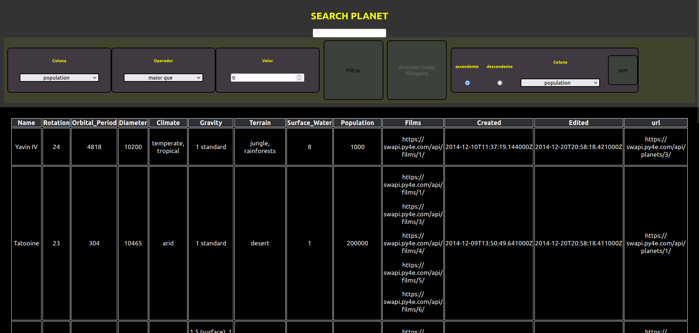

# Online Store 
Nesse projeto foi desenvolvido uma lista com filtros de planetas do universo de Star Wars usando Context API e Hooks para controlar os estados globais.  

habilidades:  
Utilizar a Context API do React para gerenciar estado.  
Utilizar o React Hook useState.  
Utilizar o React Hook useContext.  
Utilizar o React Hook useEffect.  
Criar React Hooks customizados.  
Escrever testes para garantir que sua aplicação possua uma boa cobertura de testes.  

<div align="center">
    
</div>


## Como executar  
**1. Clone o repositório**  
```shell
    git clone git@github.com:CalebeLAR/online-store.git  
```

**2. Instale as dependências**  
```shell
    npm install  
```

**3. Inicie a plicação**  
```shell
    npm start 
```

**3. Verifique a implementação de todos os testes automatizados**  
```shell
    npm test  
```

## sobre o desenvolvimento
_Sétimo projeto do modulo de front-end, que desenvolvi durante a minha formação na trybe, que forneceu os testes do cypress e elaborou um readme de requisitos de desenvolvimento._